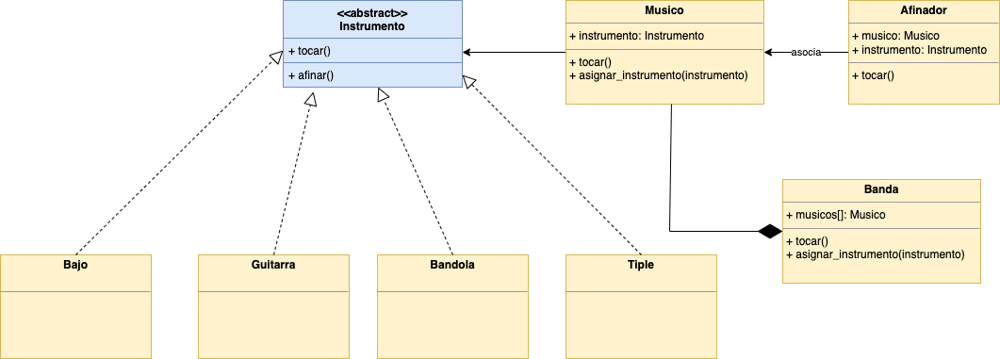
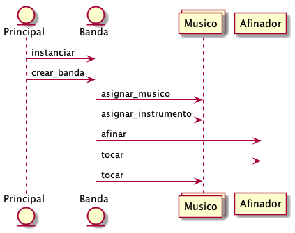

# Repositorio Informática 

Por

<b>Cesar Augusto Orozco Manotas</b>

codigo: 20220199023

## Banda de Musicos
Actividad práctica No 1 que consiste en la implementación de un problema de la banda de músicos con las siguientes
condiciones:
* Una banda esta integrada por diferentes tipos de Músicos.
* Cantidad variable de músicos
* Aleatoriedad en la composición de la banda.

[ver codigo fuente](/banda-musicos)

### Diagrama de Clases

### Diagrama de Secuencia

#### Nota
El decorador se convirtió en: Composite.